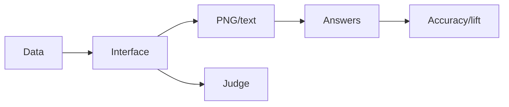
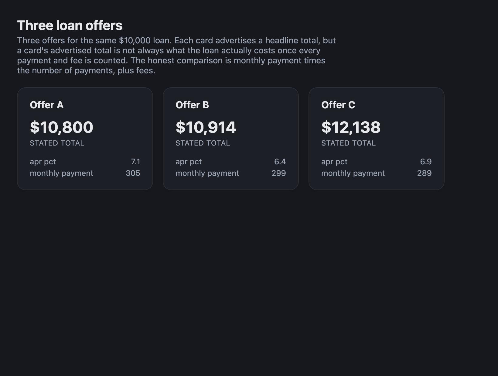
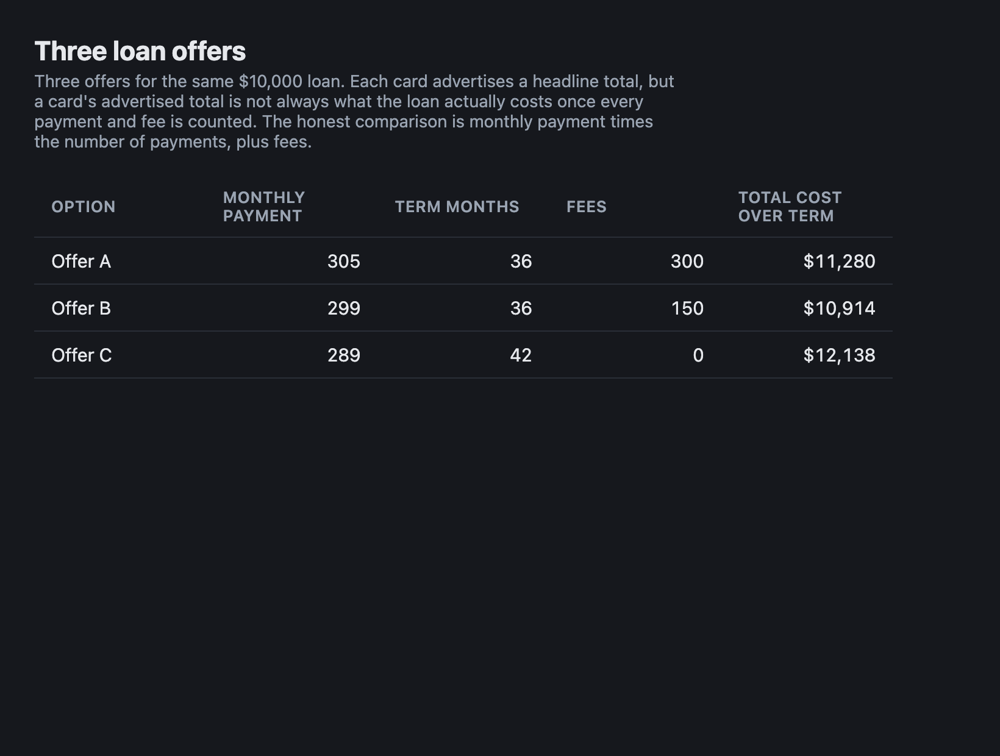
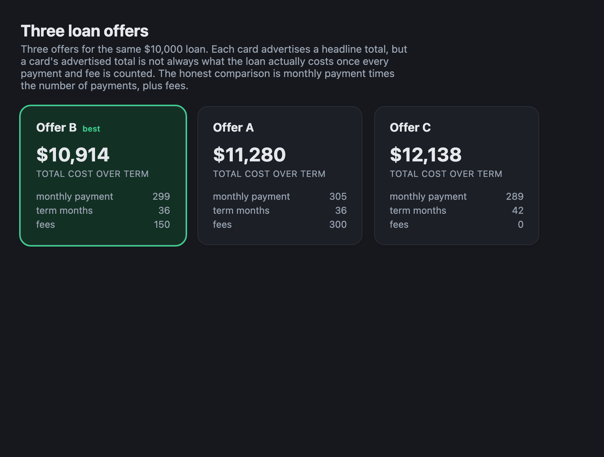

# GlassBox

Question scoring for rendered data.

**3 scenarios · 9 questions · Python 3.9+ · 0 core dependencies**

## Pipeline



## Interfaces





[Fixture](src/glassbox/_data/scenarios/loans.json) · [Protocol](docs/PROTOCOL.md)

## Verify

```sh
bash scripts/verify.sh
python3 -m pip install .
glassbox run --readers simulated --skip-render --out outputs/demo
```

## Limits

- Synthetic fixtures; human validation unrun.
- Feature search reuses scored questions.
- Live providers and training untested.

## Stack

| Core | Rendering | Reports |
| :--- | :--- | :--- |
| Python | HTML/CSS · optional Chrome | Markdown |

**Keywords:** interfaces · comprehension · scoring · provenance

[MIT](LICENSE)
